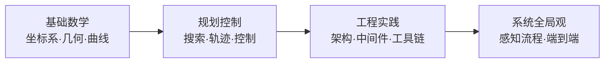

# 🚗 自动驾驶知识库

> 一套**通用**的自动驾驶学习知识库。不绑定特定厂家或车型，而是以行业通用的技术栈为主线，把**规划控制**、**工程实践**作为重点，同时用**大体流程**的方式带你看清**感知**与**端到端**这两大方向的全貌。

## 内容地图

| 模块 | 章节 | 深度 |
| --- | --- | --- |
| 🧭 **规划控制**（核心） | [规划总览](planning.md)、[搜索算法](search-algorithms.md)、[轨迹生成](trajectory-generation.md)、[控制](control.md) | ⭐⭐⭐ 重点、系统化 |
| 🛠️ **工程实践** | [工程架构](engineering.md) | ⭐⭐⭐ 重点、贴近落地 |
| 👁️ **感知**（大体流程） | [感知流程概览](perception-overview.md) | ⭐ 总览流程，不细分 |
| 🤖 **端到端**（大体流程） | [端到端流程概览](end-to-end.md) | ⭐ 总览流程 |

> 💡 **定位说明**：如果你主攻**规划控制 / 工程**方向，请重点研读「规划控制」与「工程实践」两大部分；「感知」与「端到端」提供全局认知，帮助建立对整个自动驾驶系统的整体观。

---

## 自动驾驶系统全景

一个完整的自动驾驶系统通常由以下几大模块组成，它们串成一条「感知 → 决策 → 执行」的链路：

```
┌──────────┐   ┌──────────┐   ┌──────────┐   ┌──────────┐
│  感知      │ → │  定位/地图 │ → │  规划决策  │ → │  控制执行  │
│ (Perception)│   │ (Localization│   │ (Planning)│   │ (Control)│
│           │   │  /Mapping)  │   │          │   │          │
└──────────┘   └──────────┘   └──────────┘   └──────────┘
      ↑            ↑
  ┌──────────┐   ┌───────────────────────┐
  │  传感器     │   │  中间件/计算平台/车规工程   │
  │ (Camera/  │   │  (ROS2/中间件/OS/硬件)  │
  │  LiDAR/  │   └───────────────────────┘
  │  Radar)  │
  └──────────┘
```

- **感知**：用相机、激光雷达、毫米波雷达等传感器，识别道路、障碍物、车道线、交通标志等。
- **定位/地图**：确定「车在哪」，通常依赖 GNSS、IMU、SLAM、高精地图、车道级匹配。
- **规划决策**：决定「怎么走」——从全局路径、到局部轨迹、再到决策（跟车、变道、绕障、让行）。
- **控制执行**：把规划出的轨迹交给底盘，通过油门/刹车/转向执行，并闭环纠偏。

---

## 通用学习路径

面向**通用自动驾驶工程师**（无论目标车型是乘用车、Robotaxi、还是港区 AGV / 矿区无人车，主干知识一致），建议按下面顺序学习：



### 阶段 1：基础数学（打地基）
- **坐标系与几何**：世界系/车体系、坐标变换、SE(2)/SE(3)、航向角
- **曲线与插值**：直线、圆弧、曲率，Bezier / B-Spline / Clothoid（回旋线）
- **车辆运动模型**：Bicycle Model（自行车模型）是最核心的简化模型

### 阶段 2：规划控制（主干）
- **搜索算法**：BFS、Dijkstra、A*、Hybrid A*、RRT 及变种
- **全局规划**：解决「从哪到哪」，输出 Route / Global Path
- **局部规划**：解决「眼前怎么走」，输出平滑、可执行的 Local Trajectory（DWA / TEB / MPC）
- **轨迹生成**：把 Path 升级成带时间/速度的 Trajectory（多项式、样条、优化）
- **控制**：让车沿着轨迹走（PID、Pure Pursuit、Stanley、LQR、MPC）

### 阶段 3：工程实践（落地价值最高）
- **系统架构**：感知/定位/规划/控制/执行的分层解耦
- **中间件与通信**：ROS2 / DDS、数据流、生命周期、时间同步
- **计算平台与硬件**：域控制器、传感器标定、线控底盘
- **地图与坐标**：高精地图（HD Map）、Lanelet2、OpenDrive、坐标系管理
- **开发与工具链**：C++ / Python、仿真（CARLA / Gazebo）、测试验证、功能安全

### 阶段 4：建立系统全局观
- **感知流程概览**：了解感知模块的输入输出与整体链路（不过度深入算法细节）
- **端到端流程概览**：了解「传感器进、控制出」的端到端学习范式与主干流程

---

## 面向不同岗位的侧重点

| 岗位方向 | 重点章节 | 说明 |
| --- | --- | --- |
| **规划算法工程师** | 规划控制全部 + 数学 | 深度掌握搜索、轨迹优化、MPC |
| **控制工程师** | 控制 + 车辆模型 + 工程 | PID/LQR/MPC、标定、底盘接口 |
| **工程/系统工程师** | 工程实践 + 规划控制概览 | 中间件、架构、仿真、工具链 |
| **希望建立全局认知** | 全部模块 + 感知/端到端概览 | 先总览，再选方向深耕 |

---

## 章节导航

- 🧭 **规划控制（核心）**
  - [规划总览（全局/局部规划）](planning.md)
  - [搜索算法（A*/Hybrid A*/RRT…）](search-algorithms.md)
  - [轨迹生成与优化](trajectory-generation.md)
  - [控制（PID/Pure Pursuit/MPC…）](control.md)
- 🛠️ **工程实践**
  - [工程架构与工具链](engineering.md)
- 👁️ **感知（大体流程）**
  - [感知流程概览](perception-overview.md)
- 🤖 **端到端（大体流程）**
  - [端到端流程概览](end-to-end.md)

---

*本知识库将持续更新，欢迎补充你在实际项目中的经验。*
