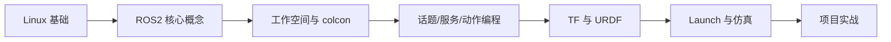

# 🤖 ROS / ROS2 知识库

> ROS（Robot Operating System，机器人操作系统）并非真正的操作系统，而是一套**开源的机器人软件框架**，提供分布式通信、工具与生态。ROS2 是其新一代版本，基于 DDS 实现实时、跨平台、安全的通信。

## 章节导航

| 章节 | 内容 |
| --- | --- |
| [ROS2 核心概念](concepts.md) | 节点、话题、服务、动作、参数、命名空间 |
| [工作空间与构建](workspace.md) | 工作空间结构、colcon 构建、ament 包 |
| [话题 · 服务 · 动作](tsa.md) | 三种通信机制的对比与使用 |
| [TF 坐标变换](tf.md) | 坐标树、TF2、静态/动态变换 |
| [URDF 与建模](urdf.md) | 机器人模型描述、URDF 标签 |
| [Launch 启动文件](launch.md) | 多节点启动、参数传递 |
| [ROS1 vs ROS2](ros1-vs-ros2.md) | 两大版本差异与迁移 |
| [学习资源导航](resources.md) | 官方文档、教程、社区 |

---

## 为什么用 ROS2？

- **实时性**：基于 DDS，支持确定性执行与 QoS 控制
- **跨平台**：支持 Linux / Windows / macOS
- **分布式**：进程间、多机通信开箱即用
- **安全**：内置 DDS 安全机制，支持加密与认证
- **开箱即用的工具链**：`rviz2`、`rqt`、`tf2`、`gazebo` 等
- **活跃生态**：机器人社区主流标准

## 学习路线



### 第一阶段：环境准备
- Linux 基础命令、Vim/VSCode、Git
- 安装 ROS2（Humble 为 LTS 版本）

### 第二阶段：核心概念
- 理解节点（Node）、话题（Topic）、服务（Service）、动作（Action）、参数（Parameter）
- 掌握 `rqt_graph` 可视化节点通信

### 第三阶段：工作空间与构建
- 创建 `ament_cmake` / `ament_python` 包
- 用 `colcon build` 构建工作空间

### 第四阶段：编程实践
- 用 C++ / Python 编写发布者-订阅者
- 实现服务端-客户端、动作服务器-客户端

### 第五阶段：机器人与仿真
- 用 URDF 描述机器人模型
- TF2 坐标变换、Launch 多节点启动
- Gazebo 仿真 + rviz2 可视化

---

## 环境速查（Ubuntu + Humble）

```bash
# 安装 ROS2 Humble
sudo apt update
sudo apt install ros-humble-desktop

# 配置环境
source /opt/ros/humble/setup.bash

# 验证
ros2 run demo_nodes_cpp talker
```

---

继续阅读 [ROS2 核心概念 →](concepts.md)
